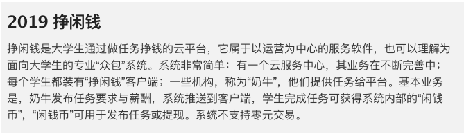
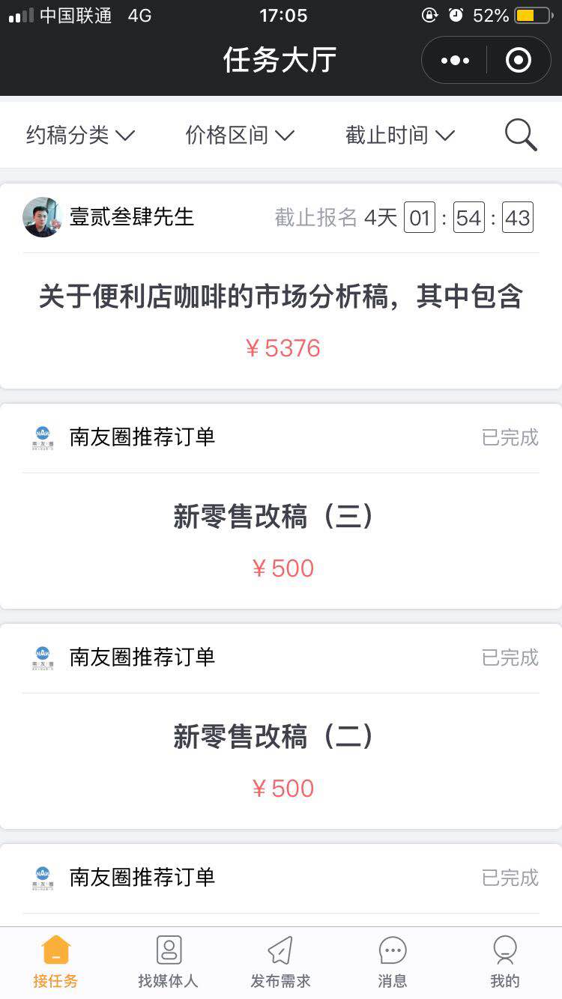
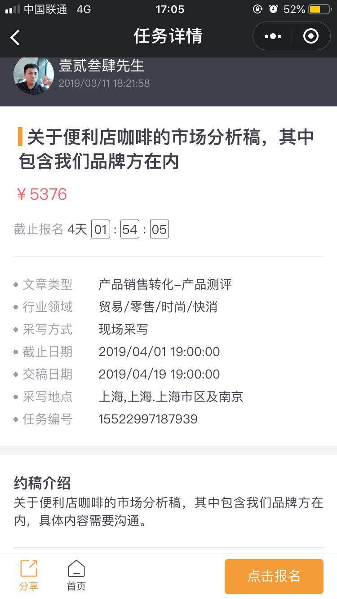
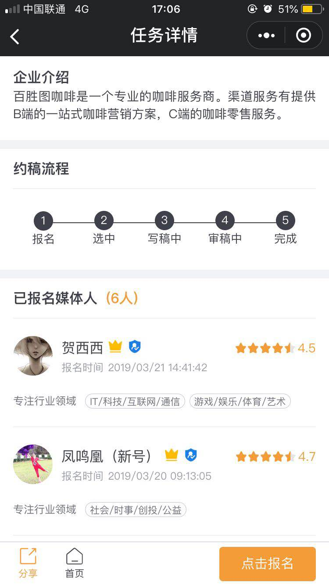
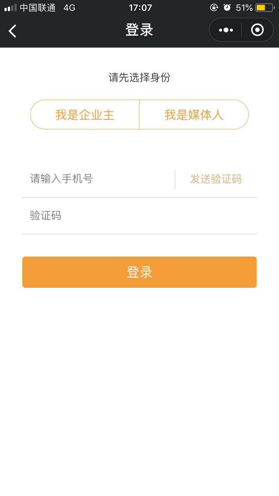
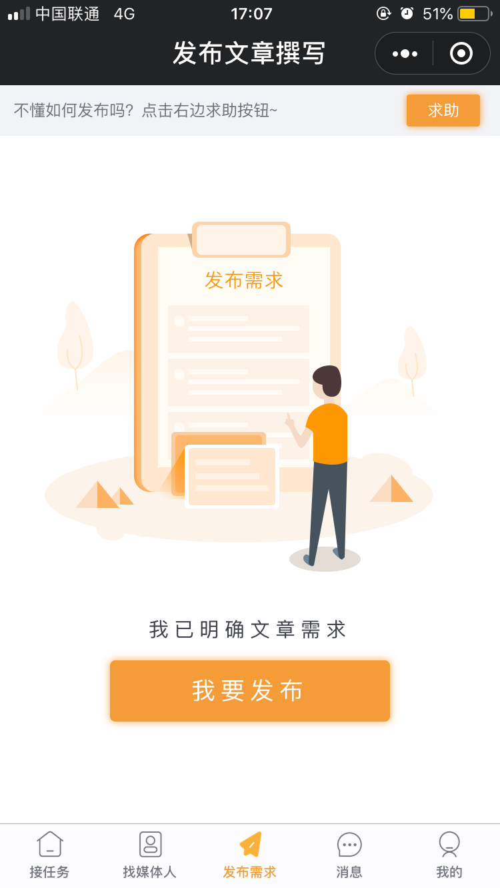
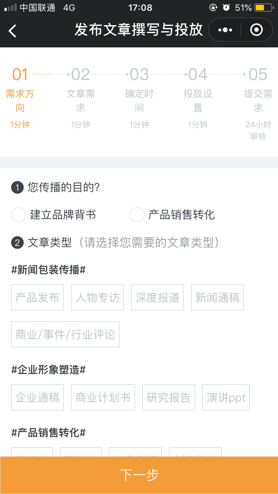

# 前期产品调研
{:.no_toc}

* 目录
{:toc}

## 第三方众包模式的发展综述

上图是本次课程设计项目的基本概述，提到了 **"众包"** 一词。 

首先 **"众包"** 是一种以自由自愿的形式将一项或多项任务，外包给非特定的大众网络，并将其高效完成的组织生产模式；众包涉及的任务通常是由个人来承担，但如果涉及到需要多人完成的任务，也有可能以依靠开源的个体生产的形式出现。在这一过程中，完成任务的对象按劳获得自己的报酬。

**“众包”** 这一概念是在2006年由一位美国记者提出，但是其所描述的商业实践，却早已存在。随着互联网的发展，大众沟通成本的降低，使得在各种层面的 **"众包"** 活动成为可能。近十年以来大量的用户生产内容（**UGC**）网站蓬勃发展，都可以理解为 **"众包"** 模式的具体表现，诸如维基百科、百度百科词条的编辑，以及Youtube、bilibili视频网站中视频的发布，都是 **"众包"** 模式的直接或间接体现。

## 关于线上众包产品的调研

**[自媒社](https://www.zimeishe.net/home)**

“自媒社”是通过面向全网“众包”的形式，为企业定制品牌推广，提升品牌知名度、品牌形象，定制具有强传播性、可读性、真实性、突出企业品牌的原创文章。简单点说就是由文章需求的用户发布自己的文章需求，具备写作技能的媒体人看到需求后接受任务并完成，获得自己的报酬。

在浏览"自媒社"网站的内容时，发现文章的类型有很多，设计行业的许多方面，金融、社会、娱乐等等，说明"自媒社"运营时的受众面很广，同时"写手"大多是一些媒体工作人、企业相关文案撰写人、媒体爱好者等等。对于需求的发布者来说，通过"自媒社"的平台满足自己的需求可以大幅降低成本，而且通过对"写手"的主动筛选，质量也得到了很好的保证；对于"写手"来说，在"自媒社"的平台可以充分锻炼自己的业务能力，并得到一定的报酬。

"自媒社"发展至今，以提供优质的线上"约稿"服务为目标，已经积累了一定数量的用户，在行业内有一定的竞争优势，是一个比较成功的 **"众包"** 案列。

**业务实现过程**

- 任务大厅：这个页面可以看到发布的各种约稿内容，可以按照约稿分类、价格区间、截止时间对任务进行排序筛选

     

         
     

- 任务详情：可以看到约稿的具体需求，包括时间、报酬、稿件内容等等

     

         
     

- 在任务详情的下方同时显示这所有申请这项工作的人员和他们的具体资料，用户可以综合考量之后进行筛	选，实现任务过程的"双选"，让工作质量得以更高的保障

     

         
     

     

         
     

- 媒体人选择：在这里用户可以根据在即的需求，选择合适的媒体人，直接进行沟通

     

         
     

- 用户注册：用户在注册时需要选择是"企业主"还是"媒体人"

     

         
     

- 稿件需求的发布

     

         
     
 
     

         
     

## 51Job校园无忧兼职

**51Job校园无忧兼职** 是一个面向在校大学生的提供的众包兼职。兼职内容分为两类：校招助理和校招播客。校招助理的主要任务有帮助企业完成招聘活动在校园内的落地执行，目前有宣讲会、笔试、面试、活动、海报张贴等类型的工作；校招播客是帮助企业在同学群体中宣传校园招聘信息。

**关于工作的具体流程**：

- 校招助理：

  队长：创建或加入团队→申请工作→安排队员→推广招聘信息→等待队员完成工作→发放奖励。

  队员：加入团队→等待团队队长申请工作→安排队员→被安排后会收到通知→了解工作详情，等待签到→现场签到→完成工作，等待评价→发放工作奖励

- 校招播客：

  标准播客：申请工作→按提示完成推广→访问人数达到3人以上→一次抽奖→工作时间结束，访问人数排名前10%→二次抽奖

**关于工作奖励的获取**：

要获取工作奖励必须先通过实名制审核，工作奖励会在结束工作的一个工作日内，通过微信红包的方式发放到微信零钱中

**无忧兼职** 的这种面向大学生的众包服务项目在校园内还是比较受欢迎的，作为''兼职''活动，它的工作内容较为简单，工作环境相对熟悉，劳务报酬的获取可靠可信，许多同学很愿意在自己的课余时间去做这份"兼职”活动，同时还可以了解招聘流程，接触更多的企业，开拓自己的视野。

