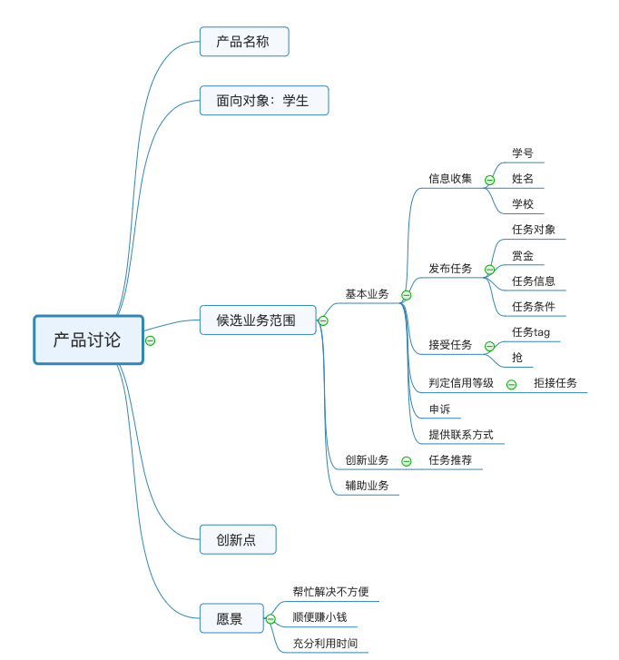
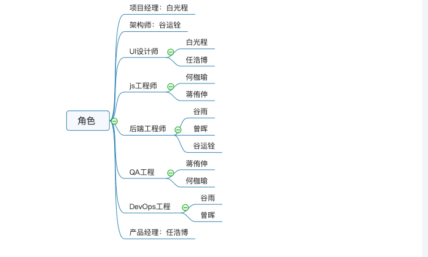

# Meeting Record 1

`2019/3/17 11:00-11:40`

`会议记录：littleGun、LightBai`

**会议目标：讨论理解项目需求，确定初步分工，明确前期调研准备阶段任务**

## 议程

1. 确定项目领域问题。解决哪些问题？以何种方式解决？

2. 分析项目涉及的商业模式。

3. 市场分析，竞品分析。

4. 初步确定技术实现路线。

5. 确定任务分工，制定开发计划。

## 会议内容

脑图：

1. [分析产品市场](../03-invest.md)，理解已上线同类型App的业务逻辑

   服务对象较广、内容涉及丰富、监管有效、市场成熟

2. 明确业务面向对象

   确定本业务是面向学生群体的短时兼职平台，注册学生群体可以发布一些自己当下不方便去完成的任务，面向平台寻找可以帮助该同学完成任务的对象，并予以一定数额金钱的奖励。

3. 明确业务范围

   根据产品市场的分析结果，以及课程作业的基本要求，确定基本业务包括注册、任务的发布、任务的执行、申诉、基本监管；希望实现的业务包括任务推荐系统、任务标签式分类。

4. 可行性分析

   目前市场上有成熟的类似的众包兼职平台，营造了较好的应用氛围，具有较好的市场前景。随着生活节奏的不断加快，零碎时间的利用变得越来越有意义，这样的平台在利用零碎时间的同时获得收益，产品概念易于推广。

5. 技术路线

   初步确定前端是以小程序方式呈现，其中的技术细节需要之后具体的技术调研。

6. 任务分工

   