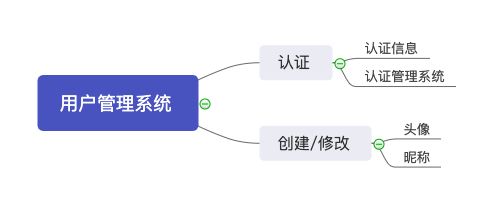

# Meeting Record 2

`2019/3/27 21:30-22:20`

`会议记录：littleGun、LightBai`

**会议目标：交流调研结果，细化用例场景，明确本次迭代的具体任务**

## 议程

1. 交流技术调研结果。前后端交互的技术实现？
2. 讨论不同用例场景下的业务逻辑。
3. 交互界面设计。
4. 哪些功能是可以先实现。
5. 确定任务分工，制定开发计划。

## 会议内容

1. 技术路线讨论

   前端：采用当下流行的小程序开发框架[WePY](https://tencent.github.io/wepy/)来实现用户端的界面交互；

   后端：Python后端flask框架，继续学习，搭建环境

2. [部分用例场景的讨论(用户管理系统)](https://sysu-gfs-3.github.io/Dashboard/UseCases/index)

   用户通过微信授权登陆，若需要在平台进行交易，需要进行身份认证

   对于用户提交的身份信息，需要平台具有相应的身份信息管理界面，方便用户管理自己的信息

   对于用户提交的认证信息，后台需要人员审核，后台需要相应的管理系统

   

3. 数据关系的梳理，数据库的设计

   分析用户在平台可能的操作，将用户数据定义如下：

   - ID（主键）
   - 微信id
   - 昵称
   - 联系方式
   - 姓名、性别
   - 头像
   - 个人介绍
   - 是否认证
   - 创建时间

4. 前端网络请求、注册登陆功能的简单实现

5. 版本控制与项目管理

   Github 仓库，上传已实现内容

   KANBAN 即使更新

   及时沟通！！！

6. Commit规范

   Commit 分为标题和主体两部分，标题要求必须要简洁明了。对标题的详细补充在主体中体现，如果标题已经充分表达出提交者的意思，主体可省略。

   操作：

   - Add 添加
   - Update 更新
   - Fix 修补
   - Delete 删除

7. 任务分工

   UI设计：白光程

   小程序前端：何枷瑜、白光程

   数据库设计：蒋侑伸

   后端框架：谷雨、谷运铨

   用例细化讨论：白光程、何枷瑜、任浩博