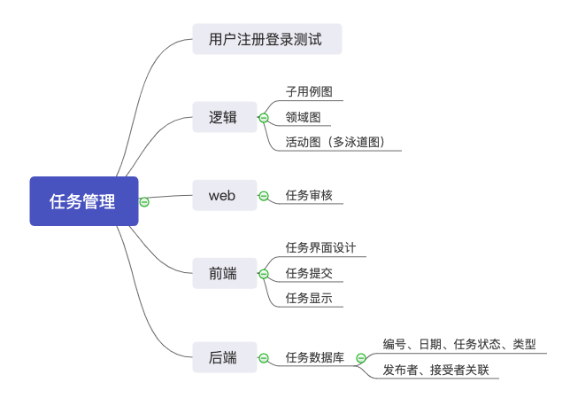

# Meeting Record 3

`2019/4/26 21:30-22:30`

`会议记录：littleGun、LightBai`

**会议目标：前期任务的总结，用例场景讨论，明确本次迭代的具体任务**

## 议程

1. 就目前项目进展做简单总结
2. 讨论一些用例场景
3. 用户交互界面设计
4. 管理平台交互界面的搭建
5. 确定任务分工，制定开发计划

## 会议内容

1. 前期总结

   项目进展总体较慢，要兼顾大家平时的其他课程，管理不到位

   用户登陆已实现，放弃之前的“注册”，改为身份认证

   用户部分新增 “组织” 概念

2. [部分用例场景的讨论(任务管理系统)](https://sysu-gfs-3.github.io/Dashboard/UseCases/index)

   任务的发布：任务名称、任务描述、任务步骤、时间限定、人员限定、赏金设定

   任务的审核：是否符合规定

   任务的接受、执行、核实

   任务的中止（任务发布者）、放弃（任务执行者）

3. 数据逻辑的理解

   数据库设计，任务与用户关联，任务的管理

   根据用户发布任务时的具体操作，任务数据初步定义如下：

   - 任务ID（主键）
   - 任务状态
   - 任务介绍
   - 任务步骤、限定（再商议）
   - 时间

   任务数据需要与用户做好映射关联

4. 管理平台的交互界面实现

   Vue框架实现

   - 用户管理
     - 用户审核 用于用户提交的认证信息的审核
     - 用户目录 详细的用户目录

   - 任务管理
     - 任务审核 用于对用户提交的任务进行审核
     - 任务目录 任务目录

5. 任务分工

   用例图、泳道图：白光程

   小程序前端：何枷瑜

   数据库设计：蒋侑伸

   管理界面：何枷瑜、蒋侑伸

   后端：谷雨、谷运铨