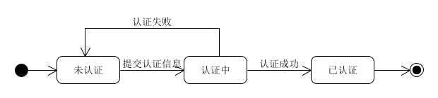
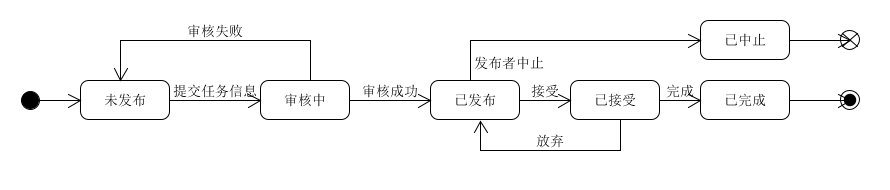
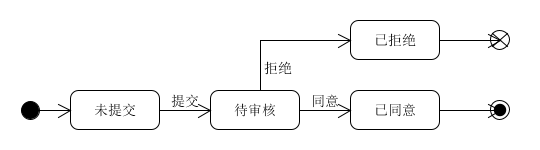

# 状态模型
{:.no_toc}

| 版本 |   日期    | 描述 |  作者   |
| :--: | :-------: | :--: | :-----: |
| v1.1 | 2019-6-24 | 用户和任务的状态模型 | littleGun |
| v1.1 | 2019-6-29 | 工作状态建模 | littleGun |

## 用户身份信息(identity)状态建模

## 任务(task)状态建模

## 工作(job)状态建模

用户在接受并完成任务后，提交工作证明的状态模型。

