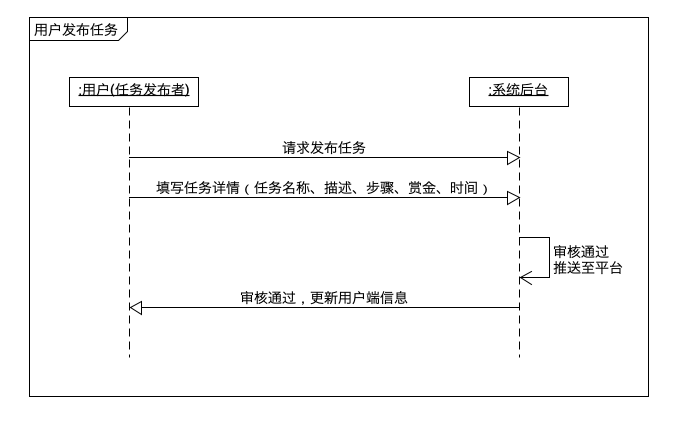
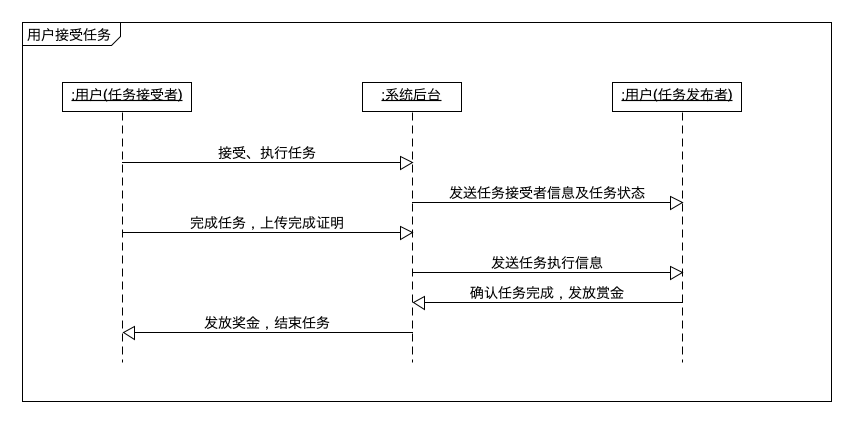
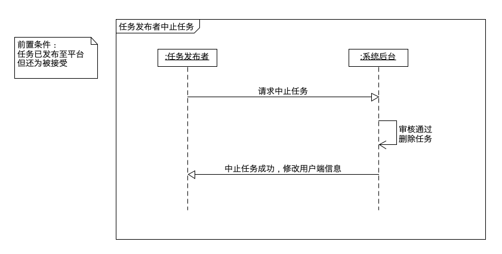
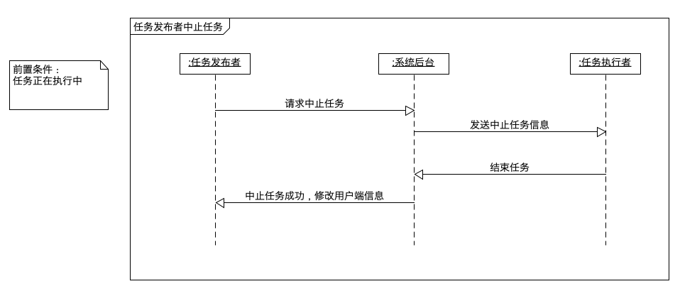
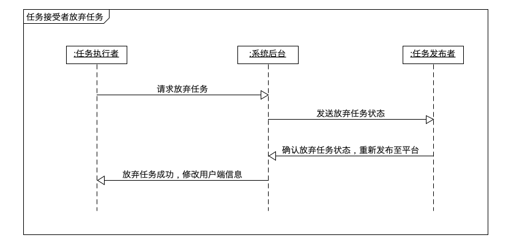
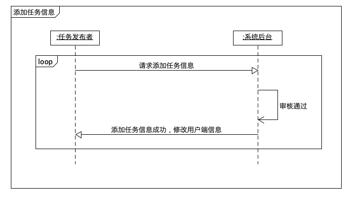

# System Sequence Diagram

| 版本 | 日期      | 描述       | 作者     |
| ---- | --------- | ---------- | -------- |
| V1.1 | 2019-6-24 | 用例顺序图 | LightBai |

### 用户身份认证

### 用户任务

- 用户发布任务

  

- 用户接受执行任务

  

- 用户中止任务

  - 任务已发布至平台但还未被接受

  

  - 任务正在执行中

    

- 用户放弃任务

  

- 用户添加任务信息

  

### 