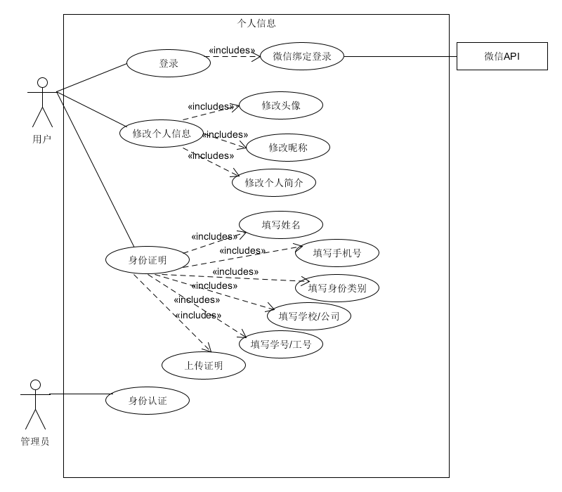

# 用例图

{:.no_toc}

| 版本 |   日期    | 描述 |  作者   |
| :--: | :-------: | :--: | :-----: |
| v1.1 | 2019-5-20 | 描述系统注册登录、修改个人信息、用户身份认证的用例图 | Gun |

## 系统用例图

下图为系统关于用户信息的子用例图，主要包括系统注册登录、修改个人信息、身份认证的用例。

## 子用例图及功能介绍

整个系统按照业务划分为下面几个用例。

- [个人信息](UserInfo)：用户信息的获取，用户可以通过系统提交以及获取个人的基本信息、身份证明信息，默认获取到的基本信息从微信服务器端获取，如头像、昵称等。管理员对用户提交的身份证明进行审核。

