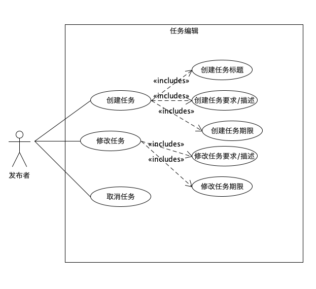
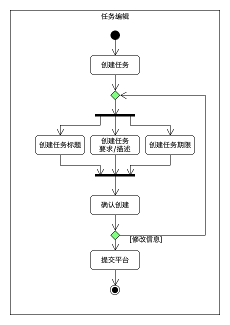
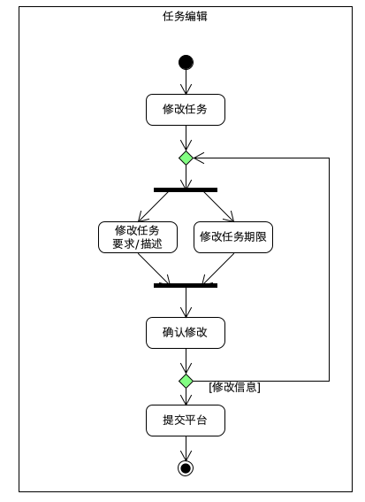
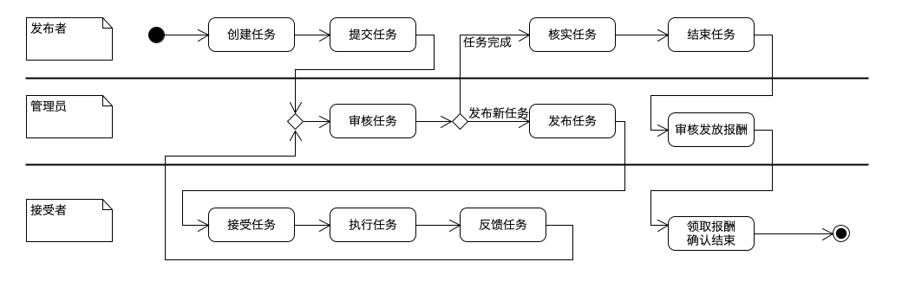

---
layout：default
title：任务编辑
---

# 任务编辑

| 版本 | 日期      | 描述                         | 作者     |
| ---- | --------- | ---------------------------- | -------- |
| v1.1 | 2019-5-29 | 任务编辑子用例活动图、泳道图 | LightBai |

## 场景描述

任务发布者需要他人帮助来完成某一任务：

- 创建任务：发布者确定任务目标、任务描述、任务要求、时间期限等需要告知任务接受者和平台的信息，再将以上确认的信息提交至平台，待平台审核通过，发布到平台；
- 任务修改：在任务发布至平台后，发布者发现任务需求有所变化需要修改任务相关信息，发布者可以对信息进行修改，修改结束后，再次提交平台审核；
- 任务取消：发布者不再有他人帮助完成任务的需求时，可以发起任务取消，平台审核通过后即可完成取消；
- 任务完成：任务接受者对自己完成的任务进行反馈，任务发布者确认任务完成后，将信息提交至平台，平台审核发放报酬。

## 用例图

## 活动图

- 任务创建活动图

  

- 任务修改活动图

  

## 泳道图

