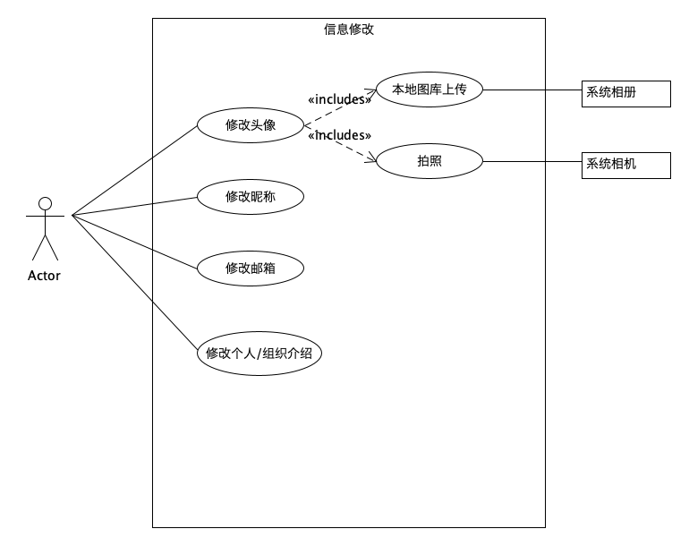
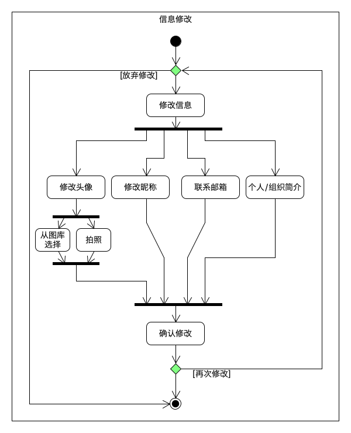

---
layout：default
title：个人信息修改
---

# 个人信息修改

| 版本 | 日期      | 描述                       | 作者     |
| ---- | --------- | -------------------------- | -------- |
| v1.1 | 2019-5-20 | 个人信息修改用例图及活动图 | LightBai |

## 场景描述

用户个人信息修改：

- 用户头像修改：用户头像默认为用户微信头像，用户可以在此处自定义头像，自定义方式有以下两种：
  - 从本地图库上传
  - 实时拍照
- 用户昵称修改：用户默认昵称为用户微信昵称，用户可以在此处自定义昵称，长度不超过16个字符；
- 用户联系邮箱修改：用户可以根据自己需求添加邮箱地址；
- 用户(个人/组织)介绍修改：用户可以在此处对自己(或组织)进行具体描述，字数不超过200。

## 用例图

## 用例活动图

