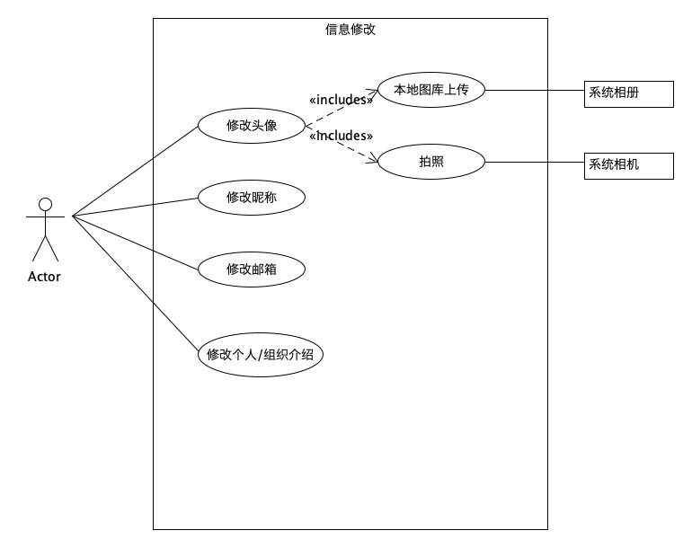

```
layout: default
title: 用例图
```

# 用例图

{:.no_toc}

| 版本 |   日期    |                         描述                         |   作者   |
| :--: | :-------: | :--------------------------------------------------: | :------: |
| v1.1 | 2019-5-20 | 描述系统注册登录、修改个人信息、用户身份认证的用例图 |   Gun    |
| V1.2 | 2019-5-21 |          添加描述修改个人信息子用例的用例图          | LightBai |
| V1.3 | 2019-5-29 |                  任务管理系统用例图                  | LightBai |

## 用户系统用例图

下图为系统关于用户信息的子用例图，主要包括系统注册登录、修改个人信息、身份认证的用例。


**子用例图及功能介绍**

用户部分的系统按照业务划分为下面几个用例。

- [个人信息](User/UserInfo.md)：用户信息的获取，用户可以通过系统提交以及获取个人的基本信息、身份证明信息，默认获取到的基本信息从微信服务器端获取，如头像、昵称等。管理员对用户提交的身份证明进行审核。

- [个人信息修改](User/ModifyInfo.md)：用户信息的修改，在此用户可以修改个人信息，包括用户昵称、用户头像、个人联系邮箱以及个人简介信息。此修改同步后台数据库。

  

## 任务系统用例图

下图为任务管理系统用例图，包括参与任务的三种角色（任务发布者、任务审核管理员、任务接受者）的用例。


**子用例图及功能介绍**

角色"发布者"参与的用例主要有任务的创建、任务的修改、任务的取消、任务的提交、任务完成的确认和酬劳的支付。

- [任务编辑](Task/EditTask.md)：发布者实现对自己发布任务的管理，可以创建一个新的任务，对已发布任务的修改（只可修改任务描述/要求和任务期限），或者是任务的取消。

  

- 提交任务：发布者完成任务创建、任务修改和取消任务的操作后，系统会先将以上信息发送至平台等待审核。

- 确认任务结束：发布者对任务完成情况进行确认，将结果返回平台，平台审核后发放报酬至任务完成用户。