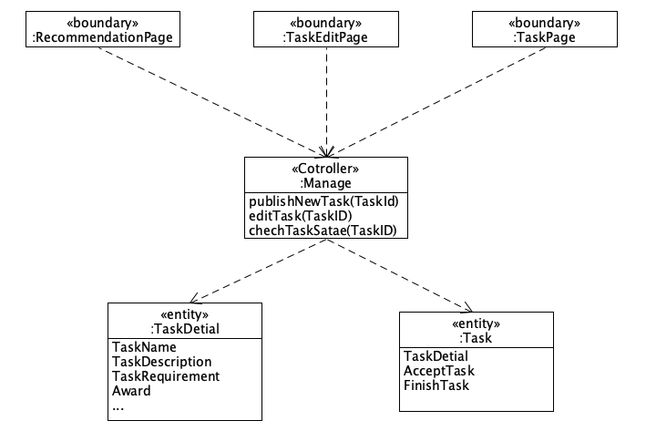
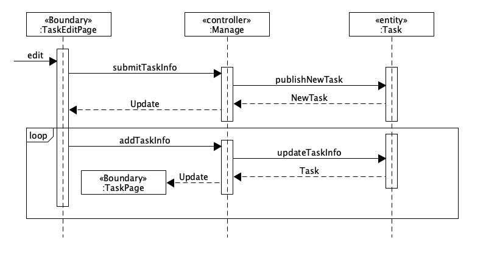

# 用例设计

## Usecase

用户登陆认证完成后，可以选择是发布任务或者接受任务

- 发布任务：用户提交任务表单信息后，后台管理进行审核，审核通过发送信息给服务器，数据交互，再返回至用户端
- 接受任务：用户选择接受一项任务后，向后台管理发出请求，审核通过后与服务器进行数据交互，再返回任务状态至用户端
- 完成任务：任务完成后，向后台管理发送任务状态，审核通过后与任务发布者进行数据交互，完成确认后进行支付奖金

## User

### class

### sepuence

