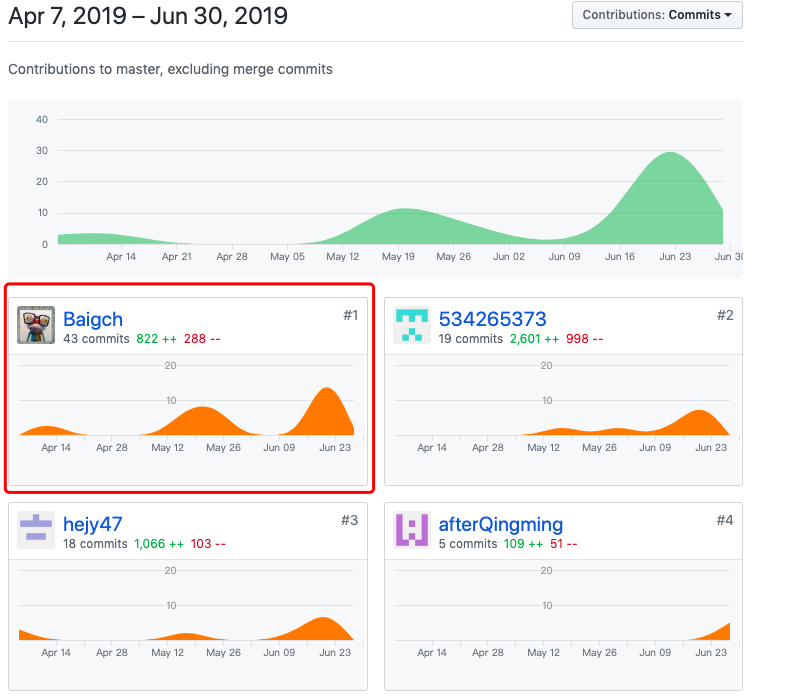
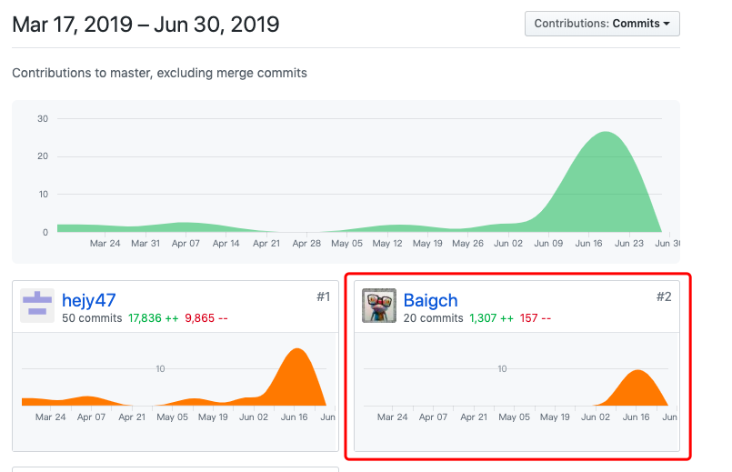

# 16341001-个人小结

>姓名：白光程
>
>学号：16341001
>
>Github：[Baigch](https://www.github.com/Baigch)

这次的项目实践中，我作为小组中最没有技术的那位，厚着脸皮当了PM，用现学现用的软件工程的相关管理方法，亲身实践具体的项目管理，毫无疑问，应为一些不可抗拒的因素，这些管理方法与真实的产品生产过程与开发环境还是有一些难以描述的不同。但是，但是我们还是一起跟完了工程项目开发的整个流程，从最开始的产品定位和需求的讨论，到具体迭代开发，再到最后的测试、文档整理，算是对软件工程开发的过程有了更加深刻的理解。

在项目的整个推进过程中，我的主要工作除了~~把握项目的整体进度~~，就是分析不同场景下的具体用例，画用例图、活动图、状态图各种图，写需求文档。除分析需求之外，我还参与了项目的原型设计，设计交互界面，期间不得不学习使用原型设计工具**Sketch**。在开发方面，我参与了前端的编写，学习了**WePY**开发框架，越发体会到自己太菜，因为菜得自己心里难受，没过多久就放弃参与前端开发。因为前后端开发的四位主力都在一个寝室，我去他们寝室一起交流，大大降低了沟通成本，使得很多问题能现场得到解决，这是让我感觉到比较舒服的地方，我也常常在夜里游走于他们四个的桌前，~~充当程序员鼓励师~~ 。

其实在开会讨论的过程中，很多时候常常会出现嫌讨论设计太麻烦要考虑的事情太多随便应付后，大家就急着上手计划开发的情况，这种情况越往后越会导致实际项目的进度与设计之间的断层越来越大，设计不清楚又导致前后端的对接变得很麻烦，甚至大规模的代码改写。实践又一次证实，花点时间搞好设计真的是能节省很多成本。

## PSP 2.1统计表

| PSP2.1                   | Personal Software Process Stages | Time (%) |
| :----------------------- | -------------------------------- | :------- |
| __Planing__              | __计划__                         | __5__    |
| Estimate                 | 估计这个任务需要多少时间         | 5        |
| __Development__          | __开发__                         | __83__   |
| Analysis                 | 需求分析                         | 30       |
| Design Spec              | 生成设计文档                     | 3        |
| Design Review            | 设计复审                         | 3        |
| Coding Standard          | 生成代码规范                     | 2        |
| Design                   | 具体设计                         | 10       |
| Coding                   | 具体编码                         | 25       |
| Code Review              | 代码复审                         | 0        |
| Test                     | 测试                             | 10       |
| __Reporting__            | __报告__                         | **12**   |
| Test Report              | 测试报告                         | 0        |
| Size Measurement         | 计算工作量                       | 4        |
| Process Improvement Plan | 事后总结及改进计划               | 8        |

## 主要工作清单

- [项目前期调研/竞品分析](03-invest.md)
- [用例设计](UseCases/index.md)
- [功能模型](SystemSequence/SSD.md)
- UI设计，原型设计
- [用户手册制作]()
- 注销、关于、组织用户界面编写

## 在项目相关仓库中的贡献

- Dashboard

  

- client

  

## 个人博客清单

[利用Sketch进行原型设计](https://baigch.github.io/SWSAD/blog/Sketch%E4%BD%BF%E7%94%A8.html)

### 致谢

最后向四位大佬致谢，感谢大家为项目的付出和对我的帮助：

@afterQingming 后端大佬挑起大梁

@hejy47 前端大佬默默无闻，任劳任怨写API

@Klunio 不管是什么，不会就找他，他就是我们的 *punchline*

@54265373 非常较真的给自己开发了一个后台管理端，简直是项目的精彩点