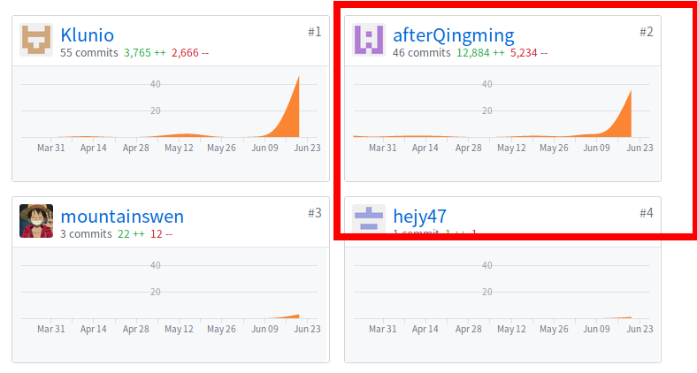

# 个人简短小结
* PSP 2.1 统计

| PSP2.1                   | Personal Software Process Stages | Time (%) |
| :----------------------- | -------------------------------- | :------- |
| __Planing__              | __计划__                         | __5__    |
| Estimate                 | 估计这个任务需要多少时间         | 5        |
| __Development__          | __开发__                         | __85__   |
| Analysis                 | 需求分析                         | 30       |
| Design Spec              | 生成设计文档                     | 3        |
| Design Review            | 设计复审                         | 3        |
| Coding Standard          | 生成代码规范                     | 2        |
| Design                   | 具体设计                         | 10       |
| Coding                   | 具体编码                         | 25       |
| Code Review              | 代码复审                         | 2        |
| Test                     | 测试                             | 10       |
| __Reporting__            | __报告__                         | **10**   |
| Test Report              | 测试报告                         | 0        |
| Size Measurement         | 计算工作量                       | 4        |
| Process Improvement Plan | 事后总结及改进计划               | 6        |
* 主要工作清单
    - 后端架构思考设计
        
        由于后端核心内容较少的用到了别人的轮子，所以很多功能要自己从新做。在UI、业务、持久化三层架构基础上我们将后端业务层分为了用户管理、任务管理、登录持久化、访问控制等主要模块。

    - 业务逻辑层中贴近UI层部分功能的实现

        由于我对数据库管理以及sql语句不熟悉，我对数据模型以及数据持久化功能参与较少，主要集中在上述四个模块：用户管理、任务管理、登录持久化、访问控制的编码。

        例如 对于访问控制功能的实现，需要考虑多种角色，是否经过认证，是否为资源的拥有者等等，业务比较复杂。虽然可以单独的每个路由分别进行判断，但代码重复量太大，而且不能使模块分离，耦合性比较高，对应模块的开发者难以专注于对应路由本身的业务。我在访问控制部分提供了中间件以及访问控制的装饰器，可以供路由方便的使用，只需要在函数前假装装饰器，并且还能方便的修改。
    - 与小程序端路由api设计的协商、测试
        
        由于小程序与WEB前端标准有所不同如默认不存在cookie导致session机制无法进行等等，我参与了部分路由及api的设计及测试
        
        后端的路由是直接由前端定义的api生成的。

    - docker快速部署

        由于项目的某些依赖python包以及其依赖的系统库的版本变更，部署时无法直接使用网上的模板，手动修改又由于对docker-compose不熟悉，测试花了比较久的时间。

* 在项目相关仓库中的贡献

* 个人博客清单
    -[docker-compose 多容器协作部署](https://afterqingming.github.io/swsad/blog/blog.html)
* 特别致谢
    - 感谢前端同学hejy47定义api，可以直接用工具生成了后端路由的代码，减少了我的工作量
    - 感谢另一位后端Klunio定义了数据模型，可以在业务逻辑中方便的使用。另外他还负责了后台管理的服务器
    - 感谢数据库管理员jiangysh设计了了数据库，还有他的管理员后台的前端部分

