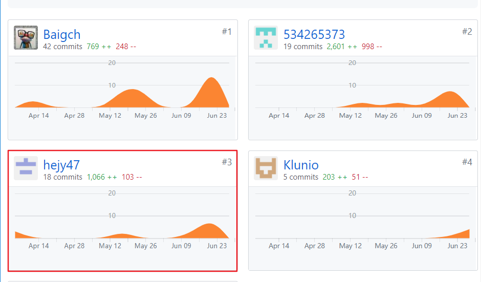
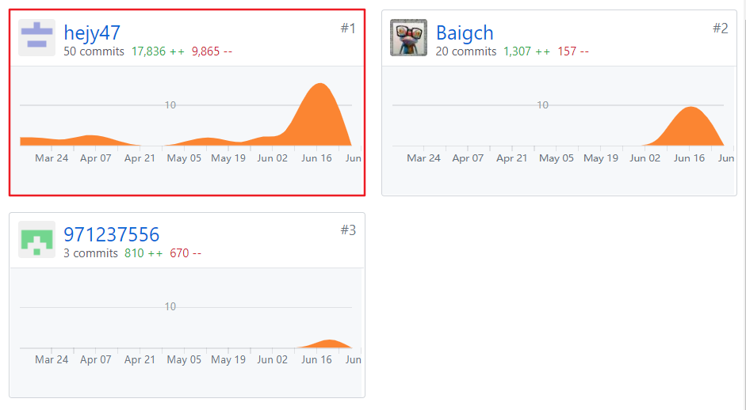

# 16341007-个人小结

## 个人简短总结

作为团队前端的主要开发者与API设计者，我的主要工作是：

* 开发微信小程序
    * 根据UI页面设计图使用wepy组件化框架和小程序IDE开发小程序前端界面的大部分页面，包括用户身份认证、任务发布接受等页面
    * 实现页面间的逻辑处理，包括页面间数据参数传递等
    * 使用postman工具的mock服务来实现前后端分离
* 搭建管理系统
    * 确定管理系统的框架Vue、组件库ElementUI以及HTTP库Axios进行基础搭建
* API接口设计
    * 使用swagger工具进行RESTFUL规范的API设计

首次接触小程序并使用wepy进行开发，以及之前从未使用过Vue框架，在项目开发前期造成给我带来很大的困难，导致前期一直在进行wepy和Vue的学习，项目推进速度较慢，也在此过程中踩了很多小程序的坑，但从中受益匪浅。另外，在进行API接口设计的过程中，由于不仔细阅读RESTFUL规范，导致API设计不规范，并进行了多次的修改，严重影响的前后端对于接口方面的开发，再一次影响了进度。综合多种原因，导致项目在最后结束的比较匆忙，让我吸取了教训也体验到的开发软件的不容易。

## PSP 2.1统计表

| PSP2.1 | Personal Software Process Stages | Time (%) |
|:--:|---|---|
| __Planing__ | __计划__ | __5__ |
| Estimate | 估计这个任务需要多少时间 | 5 |
| __Development__ | __开发__ | __85__ |
| Analysis | 需求分析 | 25 |
| Design Spec | 生成设计文档 | 3 |
| Design Review | 设计复审 | 2 |
| Coding Standard | 生成代码规范 | 2 |
| Design | 具体设计 | 5 |
| Coding | 具体编码 | 28 |
| Code Review | 代码复审 | 0 |
| Test | 测试 | 20 |
| __Reporting__ | __报告__ | __10__ |
| Test Report | 测试报告 | 0 |
| Size Measurement | 计算工作量 | 4 |
| Process Improvement Plan | 事后总结及改进计划 | 6 |

## 主要工作清单

* 分析需求和参与设计UI，在每一次会议中参与并分析需求，并和UI设计师共同进行UI设计。
* 使用swagger工具进行Restful API设计，根据[Github REST API](https://developer.github.com/v3/)规范对API进行设计，保证了前后端开发分离。
* 基本上完成对小程序的全部开发，作为主要的前端开发人员，在确定界面和功能后完成了对小程序的绝大部分开发。

## 个人GIT总结

1. Dashboard 文档集合

2. client 用户系统前端

3. client-web 管理系统前端

## 个人博客清单

* [小程序使用cookie保持登录状态](https://hejy47.github.io/Notes/%E5%B0%8F%E7%A8%8B%E5%BA%8F%E4%BD%BF%E7%94%A8cookie%E4%BF%9D%E5%AD%98%E7%99%BB%E5%BD%95%E7%8A%B6%E6%80%81)
* [微信小程序数据传递](https://hejy47.github.io/Notes/%E5%BE%AE%E4%BF%A1%E5%B0%8F%E7%A8%8B%E5%BA%8F%E6%95%B0%E6%8D%AE%E4%BC%A0%E9%80%92)
* [Postman高级应用之Mock服务](https://hejy47.github.io/Notes/Postman%E9%AB%98%E7%BA%A7%E5%BA%94%E7%94%A8%E4%B9%8Bmock%E6%9C%8D%E5%8A%A1)

## 特别致谢

* [16341001-LightBai](https://github.com/orgs/sysu-gfs-3/people/Baigch)，帮助我对小程序部分页面进行编写，减轻了我开发小程序的压力。
* [16341005-afterQingming](https://github.com/orgs/sysu-gfs-3/people/afterQingming)，和我进行前后端对接，在我多次修改API接口文档时任劳任怨地对后台代码进行修改。
* 最后还要感谢全体队员的大力支持，在我们的团队协作下虽不完美但也成功地开发了该项目。
