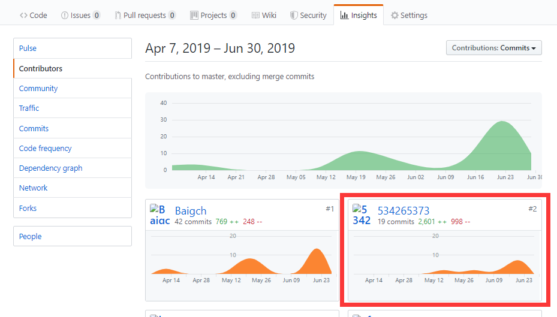
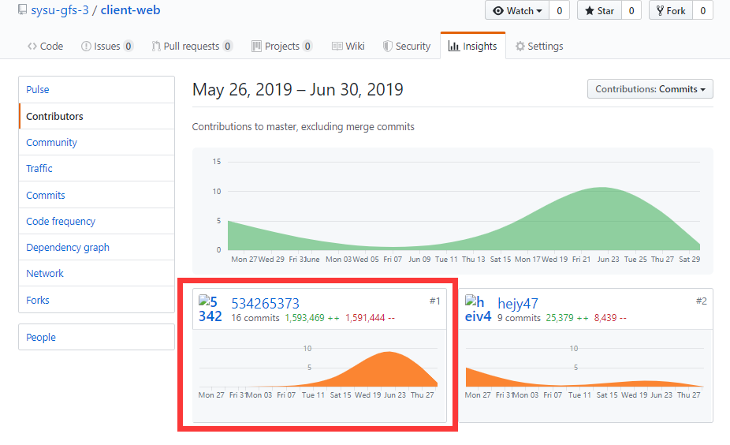

# 16341008-个人小结

## 课程学习自我总结

作为团队web前端的主要开发者与数据库设计者，我的主要工作是：

* 完善管理系统的功能实现
    * 通过使用vue-router实现方便的路由跳转，降低程序复杂度
    * 通过使用Axios实现发送post请求，获取接口服务
    * 通过使用ECharts实现对用户，任务等数据进行挖掘和整合，并通过图表进行直观展示
    * 实现页面间的逻辑处理
* 数据库的设计
    * 使用MySQL Workbench工具进行数据库的设计

首先，与队友多次会议讨论后，设计了项目的领域图，并使用MySQL Workbench工具进行数据库的设计，由于开始许多细节没有仔细讨论，数据库的第一个版本存在许多问题，在接下来的项目开发中，与后端开发者讨论，不断完善数据库的设计。数据库是伴随着整个项目的进行，在不断的迭代，数据库需要考虑整个项目的需求和方便后端开发者进行合理设计。数据库设计的合理性直接影响着整个项目开发的效率，在本次项目开发中，数据库设计其实存在一些不合理，但最后若重新修改整个数据库的结构，已经不现实了，这也导致后端开发者在需要使用相应的sql查询语句时，遇到巨大困难。

在web前端的开发中，使用第一次接触的Vue框架，使用Axios，ACharts等来进行服务器接口调用和数据统计，前端开发的心酸就不赘述了。

最后，非常感谢队友们在开发过程的大力帮助。

## PSP 2.1统计表

| PSP2.1 | Personal Software Process Stages | Time (%) |
|:--:|---|---|
| __Planing__ | __计划__ | __5__ |
| Estimate | 估计这个任务需要多少时间 | 5 |
| __Development__ | __开发__ | __87__ |
| Analysis | 需求分析 | 20 |
| Design Spec | 生成设计文档 | 3 |
| Design Review | 设计复审 | 4 |
| Coding Standard | 生成代码规范 | 2 |
| Design | 具体设计 | 7 |
| Coding | 具体编码 | 30 |
| Code Review | 代码复审 | 1 |
| Test | 测试 | 20 |
| __Reporting__ | __报告55__| __8__ |
| Test Report | 测试报告 | 0 |
| Size Measurement | 计算工作量 | 2 |
| Process Improvement Plan | 事后总结及改进计划 | 6 |

## 主要工作清单
最得意：分析需求和设计UI。提出我们项目的亮点：多人点餐和个人推荐，直击用户心底；并参考 App-Store 设计，给出一套清新脱俗的界面

最有价值：在我的管理下我们的团队沟通有效，开发有条不紊。这个说起来容易做起来难，我们是全班少数的几乎每两周全体成员都有一定贡献的团队！

最有苦劳：独自创建挣闲钱管理系统。使用 vue-cli 生成，并确定项目架构，将商家管理系统限制在一个组件化的、统一接口、高复用、简洁美观的范围内。这使得我们对商家管理系统的重构可以在一周内完成

## 在项目相关仓库中的贡献，仅需要截图  
  
#### **Dashboard 文档集合包含数据库设计spl代码**

#### **client-web 后台管理系统前端**

## 个人博客清单
- [16341008-方便的EChart---使用图表展示数据](https://534265373.github.io/Note/%E6%96%B9%E4%BE%BF%E7%9A%84EChart------%E4%BD%BF%E7%94%A8%E5%9B%BE%E8%A1%A8%E5%B1%95%E7%A4%BA%E6%95%B0%E6%8D%AE.html)

## 特别致谢
感谢后台队友 16341006-Klunio，在构建后台管理系统前段时，总是能提供合适的相应接口，满足需求